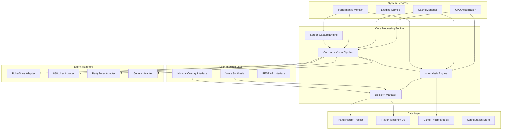
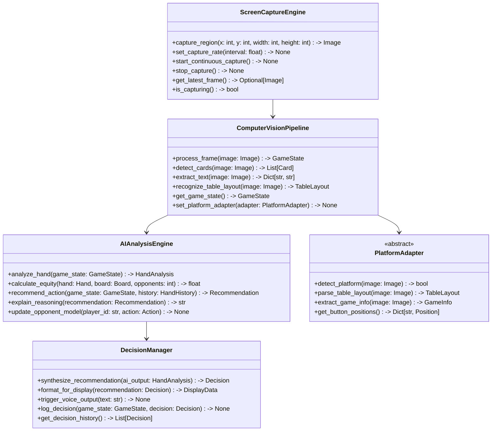

# Poker Analysis System - Comprehensive Architecture

**Project**: Real-time Poker Analysis and Decision Support System  
**Purpose**: Research and isolated testing environments only  
**Target Platforms**: Windows and macOS  
**Development Timeline**: 4-6 weeks (40 hours/week)  
**Date**: January 2025

## Executive Summary

This document outlines the comprehensive architecture for a Python-based real-time poker analysis system designed for research purposes in controlled testing environments. The system provides advanced AI-driven decision support with sub-500ms response times, 99.5%+ card recognition accuracy, and maintains a sub-50MB memory footprint.

## System Architecture Overview

### High-Level Architecture Diagram



### Core Architectural Principles

1. **Modular Design**: Loosely coupled components with well-defined interfaces
2. **Real-time Performance**: Sub-500ms response times with adaptive processing
3. **Cross-platform Compatibility**: Windows and macOS support with unified interfaces
4. **Memory Efficiency**: Sub-50MB operational footprint with intelligent caching
5. **Extensibility**: Plugin architecture for adding new poker platforms and variants
6. **Research Focus**: Designed for controlled testing environments and academic study

## Technology Stack

### Core Technologies
- **Language**: Python 3.11+ (performance optimizations, type hints)
- **Computer Vision**: OpenCV 4.8+, YOLO v8, PyTorch 2.0+
- **OCR**: Tesseract 5.0+, EasyOCR
- **AI/ML**: scikit-learn, NumPy, Pandas, SciPy
- **GUI**: Tkinter (minimal overlay), PyQt6 (advanced interface)
- **Voice**: pyttsx3, gTTS
- **Database**: SQLite (embedded), Redis (caching)
- **API**: FastAPI, uvicorn
- **Async**: asyncio, aiofiles

### Platform-Specific Libraries
- **Windows**: pywin32, mss (screen capture), win32gui
- **macOS**: pyobjc, Quartz (screen capture), AppKit
- **GPU**: CUDA toolkit, cuDNN, CuPy (when available)

### Development Acceleration Tools
- **MCP Filesystem**: Rapid file operations and project management
- **MCP GitHub**: Automated version control and collaboration
- **Puppeteer MCP**: Automated browser testing for web-based poker platforms
- **Tavily MCP**: Research and documentation automation

### Testing & Quality
- **Testing**: pytest, unittest, hypothesis, pytest-asyncio
- **Profiling**: cProfile, memory_profiler, py-spy
- **Code Quality**: black, flake8, mypy, pre-commit
- **Documentation**: Sphinx, mkdocs

## Project Structure

```
poker_analysis_system/
├── src/
│   ├── core/
│   │   ├── __init__.py
│   │   ├── screen_capture.py      # Multi-threaded screen capture engine
│   │   ├── computer_vision.py     # CV pipeline orchestrator
│   │   ├── ai_engine.py          # AI analysis coordinator
│   │   └── decision_manager.py    # Decision synthesis and output
│   ├── vision/
│   │   ├── __init__.py
│   │   ├── card_detector.py       # YOLO-based card detection
│   │   ├── table_parser.py        # Table layout recognition
│   │   ├── ocr_engine.py         # Text extraction and processing
│   │   ├── preprocessing.py       # Image enhancement and filtering
│   │   └── region_detector.py     # Screen region identification
│   ├── ai/
│   │   ├── __init__.py
│   │   ├── holdem_engine.py      # Texas Hold'em specific logic
│   │   ├── equity_calculator.py  # Hand equity analysis
│   │   ├── gto_solver.py         # Game theory optimal calculations
│   │   ├── opponent_modeling.py  # Player tendency analysis
│   │   ├── range_analyzer.py     # Hand range calculations
│   │   ├── strategy_engine.py    # Decision recommendation
│   │   └── probability_calc.py   # Statistical calculations
│   ├── platforms/
│   │   ├── __init__.py
│   │   ├── base_adapter.py       # Abstract platform interface
│   │   ├── pokerstars.py         # PokerStars-specific logic
│   │   ├── poker888.py           # 888poker-specific logic
│   │   ├── partypoker.py         # PartyPoker-specific logic
│   │   ├── auto_detector.py      # Platform auto-detection
│   │   └── platform_registry.py  # Platform management
│   ├── data/
│   │   ├── __init__.py
│   │   ├── hand_history.py       # Hand tracking and storage
│   │   ├── player_database.py    # Player statistics and tendencies
│   │   ├── game_state.py         # Current game state management
│   │   ├── cache_manager.py      # Performance caching layer
│   │   └── models.py            # Data models and schemas
│   ├── ui/
│   │   ├── __init__.py
│   │   ├── overlay.py            # Minimal overlay interface
│   │   ├── voice_output.py       # Text-to-speech synthesis
│   │   ├── api_server.py         # REST API interface
│   │   └── display_manager.py    # Output formatting and display
│   ├── utils/
│   │   ├── __init__.py
│   │   ├── performance.py        # Performance monitoring
│   │   ├── logging_config.py     # Logging configuration
│   │   ├── config.py            # Configuration management
│   │   ├── exceptions.py        # Custom exception classes
│   │   └── decorators.py        # Utility decorators
│   └── extensions/
│       ├── __init__.py
│       └── future_variants.py    # Extension points for other poker variants
├── models/
│   ├── card_detection/          # Pre-trained YOLO models
│   │   ├── yolov8_cards.pt
│   │   └── card_labels.txt
│   ├── table_recognition/       # CNN models for table layout
│   │   └── table_classifier.pt
│   └── gto_precomputed/        # Pre-computed GTO solutions
│       └── holdem_ranges.json
├── data/
│   ├── training_images/         # Training data for CV models
│   │   ├── cards/
│   │   ├── tables/
│   │   └── platforms/
│   ├── hand_histories/          # Historical game data
│   └── player_profiles/         # Player tendency data
├── tests/
│   ├── __init__.py
│   ├── unit/                    # Unit tests
│   │   ├── test_computer_vision.py
│   │   ├── test_ai_engine.py
│   │   └── test_platforms.py
│   ├── integration/             # Integration tests
│   │   ├── test_end_to_end.py
│   │   └── test_performance.py
│   ├── performance/             # Performance benchmarks
│   │   └── benchmark_suite.py
│   └── fixtures/               # Test data and fixtures
├── docs/
│   ├── api/                    # API documentation
│   ├── user_guide/            # User documentation
│   └── development/           # Development guides
├── scripts/
│   ├── setup.py              # Development environment setup
│   ├── train_models.py       # Model training scripts
│   └── benchmark.py          # Performance benchmarking
├── requirements.txt           # Python dependencies
├── requirements-dev.txt       # Development dependencies
├── setup.py                  # Package configuration
├── pyproject.toml           # Modern Python project configuration
├── .gitignore               # Git ignore rules
├── README.md                # Project overview
└── main.py                  # Application entry point
```

## Component Interfaces

### Core Interface Definitions



---
**Document Version**: 1.0  
**Last Updated**: January 2025  
**Next Review**: Upon completion of Phase 1 implementation