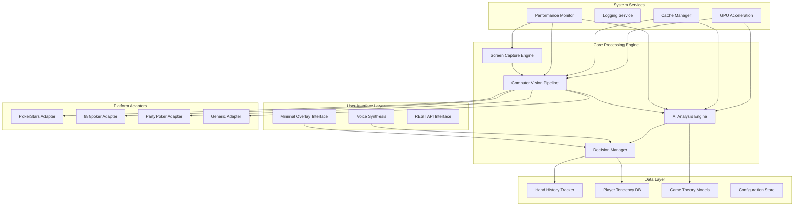
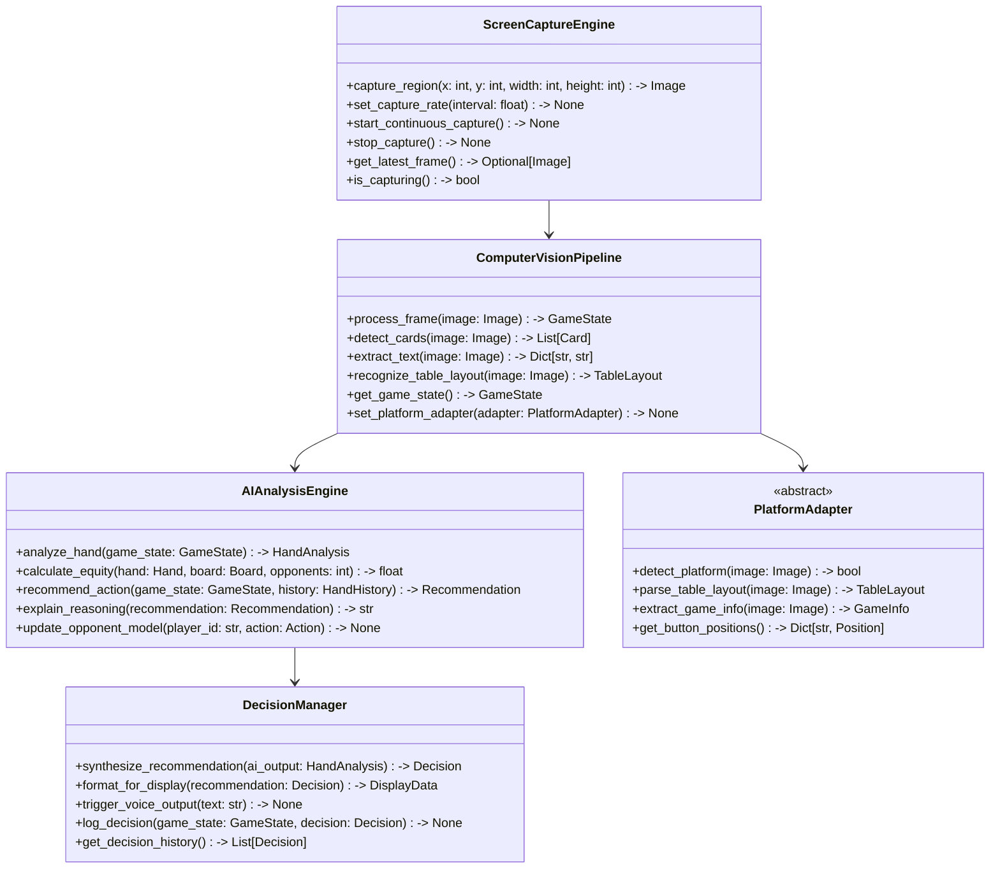
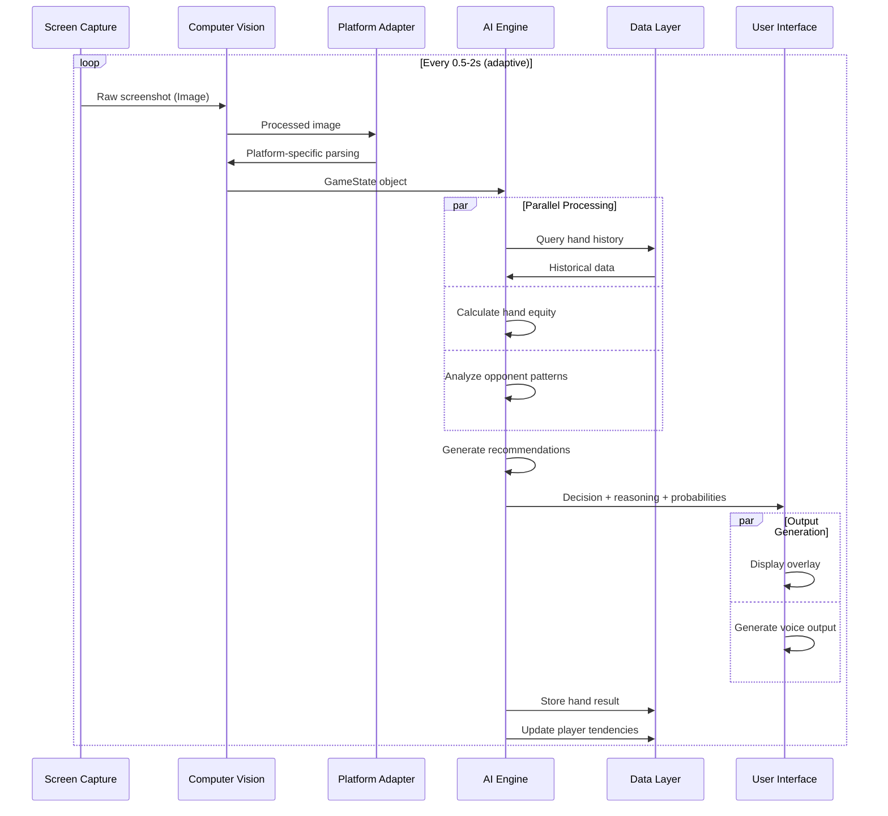
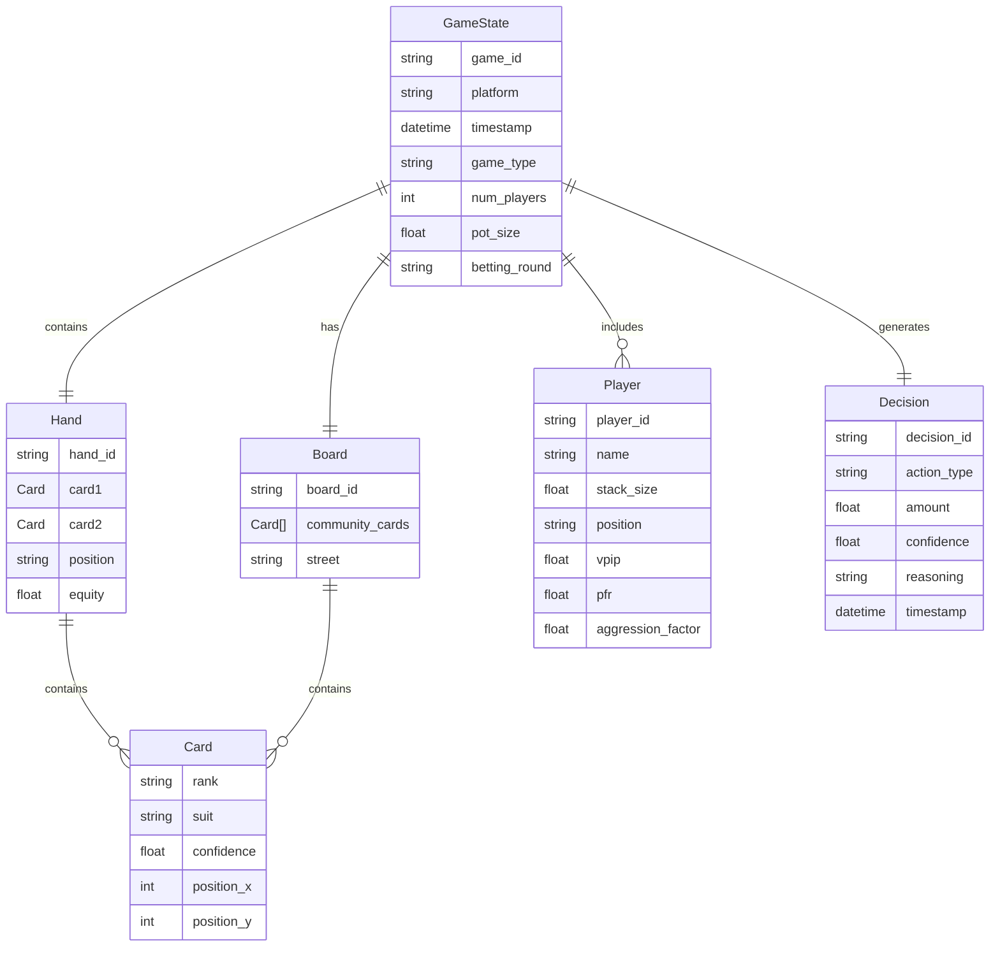
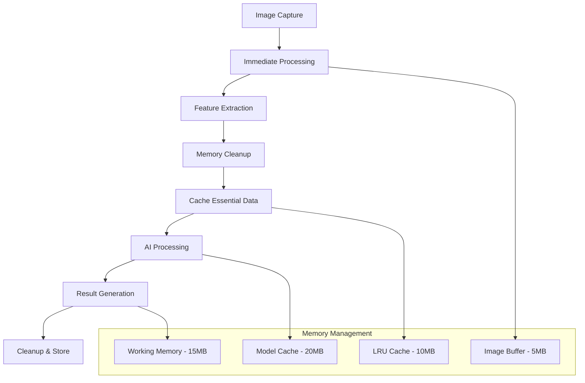
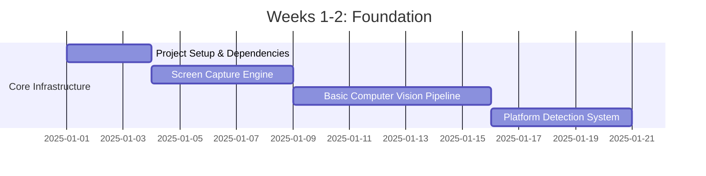
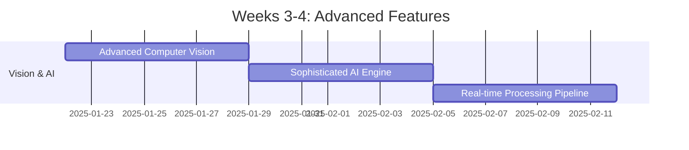
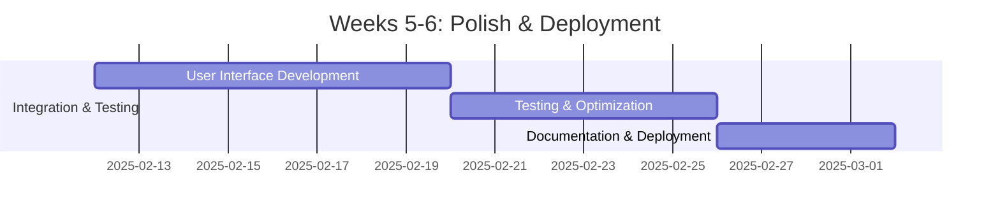

# Poker Analysis System - Comprehensive Architecture

**Project**: Real-time Poker Analysis and Decision Support System  
**Purpose**: Research and isolated testing environments only  
**Target Platforms**: Windows and macOS  
**Development Timeline**: 4-6 weeks (40 hours/week)  
**Date**: January 2025

## Executive Summary

This document outlines the comprehensive architecture for a Python-based real-time poker analysis system designed for research purposes in controlled testing environments. The system provides advanced AI-driven decision support with sub-500ms response times, 99.5%+ card recognition accuracy, and maintains a sub-50MB memory footprint.

## System Architecture Overview

### High-Level Architecture Diagram



### Core Architectural Principles

1. **Modular Design**: Loosely coupled components with well-defined interfaces
2. **Real-time Performance**: Sub-500ms response times with adaptive processing
3. **Cross-platform Compatibility**: Windows and macOS support with unified interfaces
4. **Memory Efficiency**: Sub-50MB operational footprint with intelligent caching
5. **Extensibility**: Plugin architecture for adding new poker platforms and variants
6. **Research Focus**: Designed for controlled testing environments and academic study

## Technology Stack

### Core Technologies
- **Language**: Python 3.11+ (performance optimizations, type hints)
- **Computer Vision**: OpenCV 4.8+, YOLO v8, PyTorch 2.0+
- **OCR**: Tesseract 5.0+, EasyOCR
- **AI/ML**: scikit-learn, NumPy, Pandas, SciPy
- **GUI**: Tkinter (minimal overlay), PyQt6 (advanced interface)
- **Voice**: pyttsx3, gTTS
- **Database**: SQLite (embedded), Redis (caching)
- **API**: FastAPI, uvicorn
- **Async**: asyncio, aiofiles

### Platform-Specific Libraries
- **Windows**: pywin32, mss (screen capture), win32gui
- **macOS**: pyobjc, Quartz (screen capture), AppKit
- **GPU**: CUDA toolkit, cuDNN, CuPy (when available)

### Development Acceleration Tools
- **MCP Filesystem**: Rapid file operations and project management
- **MCP GitHub**: Automated version control and collaboration
- **Puppeteer MCP**: Automated browser testing for web-based poker platforms
- **Tavily MCP**: Research and documentation automation

### Testing & Quality
- **Testing**: pytest, unittest, hypothesis, pytest-asyncio
- **Profiling**: cProfile, memory_profiler, py-spy
- **Code Quality**: black, flake8, mypy, pre-commit
- **Documentation**: Sphinx, mkdocs

## Project Structure

```
poker_analysis_system/
├── src/
│   ├── core/
│   │   ├── __init__.py
│   │   ├── screen_capture.py      # Multi-threaded screen capture engine
│   │   ├── computer_vision.py     # CV pipeline orchestrator
│   │   ├── ai_engine.py          # AI analysis coordinator
│   │   └── decision_manager.py    # Decision synthesis and output
│   ├── vision/
│   │   ├── __init__.py
│   │   ├── card_detector.py       # YOLO-based card detection
│   │   ├── table_parser.py        # Table layout recognition
│   │   ├── ocr_engine.py         # Text extraction and processing
│   │   ├── preprocessing.py       # Image enhancement and filtering
│   │   └── region_detector.py     # Screen region identification
│   ├── ai/
│   │   ├── __init__.py
│   │   ├── holdem_engine.py      # Texas Hold'em specific logic
│   │   ├── equity_calculator.py  # Hand equity analysis
│   │   ├── gto_solver.py         # Game theory optimal calculations
│   │   ├── opponent_modeling.py  # Player tendency analysis
│   │   ├── range_analyzer.py     # Hand range calculations
│   │   ├── strategy_engine.py    # Decision recommendation
│   │   └── probability_calc.py   # Statistical calculations
│   ├── platforms/
│   │   ├── __init__.py
│   │   ├── base_adapter.py       # Abstract platform interface
│   │   ├── pokerstars.py         # PokerStars-specific logic
│   │   ├── poker888.py           # 888poker-specific logic
│   │   ├── partypoker.py         # PartyPoker-specific logic
│   │   ├── auto_detector.py      # Platform auto-detection
│   │   └── platform_registry.py  # Platform management
│   ├── data/
│   │   ├── __init__.py
│   │   ├── hand_history.py       # Hand tracking and storage
│   │   ├── player_database.py    # Player statistics and tendencies
│   │   ├── game_state.py         # Current game state management
│   │   ├── cache_manager.py      # Performance caching layer
│   │   └── models.py            # Data models and schemas
│   ├── ui/
│   │   ├── __init__.py
│   │   ├── overlay.py            # Minimal overlay interface
│   │   ├── voice_output.py       # Text-to-speech synthesis
│   │   ├── api_server.py         # REST API interface
│   │   └── display_manager.py    # Output formatting and display
│   ├── utils/
│   │   ├── __init__.py
│   │   ├── performance.py        # Performance monitoring
│   │   ├── logging_config.py     # Logging configuration
│   │   ├── config.py            # Configuration management
│   │   ├── exceptions.py        # Custom exception classes
│   │   └── decorators.py        # Utility decorators
│   └── extensions/
│       ├── __init__.py
│       └── future_variants.py    # Extension points for other poker variants
├── models/
│   ├── card_detection/          # Pre-trained YOLO models
│   │   ├── yolov8_cards.pt
│   │   └── card_labels.txt
│   ├── table_recognition/       # CNN models for table layout
│   │   └── table_classifier.pt
│   └── gto_precomputed/        # Pre-computed GTO solutions
│       └── holdem_ranges.json
├── data/
│   ├── training_images/         # Training data for CV models
│   │   ├── cards/
│   │   ├── tables/
│   │   └── platforms/
│   ├── hand_histories/          # Historical game data
│   └── player_profiles/         # Player tendency data
├── tests/
│   ├── __init__.py
│   ├── unit/                    # Unit tests
│   │   ├── test_computer_vision.py
│   │   ├── test_ai_engine.py
│   │   └── test_platforms.py
│   ├── integration/             # Integration tests
│   │   ├── test_end_to_end.py
│   │   └── test_performance.py
│   ├── performance/             # Performance benchmarks
│   │   └── benchmark_suite.py
│   └── fixtures/               # Test data and fixtures
├── docs/
│   ├── api/                    # API documentation
│   ├── user_guide/            # User documentation
│   └── development/           # Development guides
├── scripts/
│   ├── setup.py              # Development environment setup
│   ├── train_models.py       # Model training scripts
│   └── benchmark.py          # Performance benchmarking
├── requirements.txt           # Python dependencies
├── requirements-dev.txt       # Development dependencies
├── setup.py                  # Package configuration
├── pyproject.toml           # Modern Python project configuration
├── .gitignore               # Git ignore rules
├── README.md                # Project overview
└── main.py                  # Application entry point
```

## Component Interfaces

### Core Interface Definitions



## Data Flow Architecture

### Real-time Processing Flow



### Data Models



## Performance & Resource Management

### Performance Targets
- **Response Time**: <500ms from capture to recommendation
- **Memory Usage**: <50MB steady state operation
- **CPU Usage**: <20% on modern hardware (Intel i5/AMD Ryzen 5 or better)
- **GPU Memory**: <2GB VRAM when GPU acceleration is available
- **Accuracy**: 99.5%+ card recognition accuracy
- **Reliability**: 99.9% uptime during operation

### Memory Optimization Strategy



### Optimization Techniques
1. **Image Processing**: Streaming processing with immediate memory release
2. **Model Loading**: Lazy loading with intelligent caching
3. **Data Storage**: SQLite with WAL mode, periodic cleanup
4. **Cache Management**: LRU cache with configurable size limits
5. **GPU Utilization**: CUDA acceleration when available, CPU fallback
6. **Async Processing**: Non-blocking operations with queue management

## Accelerated Development Roadmap

### Overview Timeline
**Total Duration**: 4-6 weeks (160-240 hours)  
**Team**: 2 developers (You + AI Assistant)  
**Work Schedule**: 40 hours/week  
**Development Approach**: Agile with daily iterations

### Week 1-2: Foundation & Core Infrastructure



**Days 1-3: Project Scaffolding** (24 hours)
- Leverage MCP filesystem tools for rapid project structure creation
- Automated dependency management and virtual environment setup
- Git repository initialization with GitHub integration
- Development environment configuration (VSCode, debugging setup)
- Cross-platform screen capture engine with performance optimization

**Days 4-7: Computer Vision Foundation** (32 hours)
- YOLO v8 integration with pre-trained models
- OpenCV pipeline for real-time image processing
- Basic image preprocessing and enhancement
- Platform detection system for PokerStars, 888poker, PartyPoker
- Initial card detection algorithms

**Days 8-10: Basic AI Framework** (24 hours)
- Texas Hold'em specific equity calculator
- Basic hand evaluation algorithms
- Initial GTO solver integration
- Decision engine structure and interfaces
- Data models and persistence layer

### Week 3-4: Advanced Features & Integration



**Days 11-14: Advanced Computer Vision** (32 hours)
- 99.5%+ card recognition accuracy achievement
- OCR integration for text extraction (pot sizes, player names, stack sizes)
- Table layout recognition and parsing
- Platform-specific adapters implementation
- Region detection optimization

**Days 15-18: Sophisticated AI Engine** (32 hours)
- Advanced equity calculations with Monte Carlo simulations
- Opponent modeling and tendency tracking
- Hand range analysis specific to Texas Hold'em
- Statistical analysis integration
- GTO strategy implementation

**Days 19-21: Real-time Processing Pipeline** (24 hours)
- Multi-threaded architecture implementation
- Asynchronous processing optimization
- <500ms response time achievement
- Memory footprint optimization (<50MB)
- Performance monitoring integration

### Week 5-6: Polish & Deployment



**Days 22-25: User Interface & Integration** (32 hours)
- Minimal overlay interface development
- Voice synthesis integration with customizable options
- REST API for external integrations
- Configuration management system
- User preferences and settings

**Days 26-28: Testing & Optimization** (24 hours)
- Comprehensive testing suite with automated validation
- Performance benchmarking and optimization
- Cross-platform compatibility verification
- Memory leak detection and resolution
- Stress testing with extended operation

**Days 29-30: Documentation & Deployment** (16 hours)
- Complete technical documentation
- User guides and API documentation
- Deployment guides for Windows and macOS
- Final system validation and acceptance testing
- Release preparation and packaging

## Key Architectural Decisions

### 1. Modular Platform Adapters
**Decision**: Abstract base class with platform-specific implementations  
**Rationale**: Enables easy addition of new poker platforms without core system changes  
**Implementation**: Plugin architecture with auto-detection capabilities

### 2. Asynchronous Processing Architecture
**Decision**: Separate threads for capture, processing, and AI analysis  
**Rationale**: Maintains real-time performance with non-blocking operations  
**Implementation**: asyncio with queue-based communication between components

### 3. Hybrid Data Storage Strategy
**Decision**: SQLite for persistence, Redis for caching, in-memory for real-time state  
**Rationale**: Optimizes for both performance and data integrity  
**Implementation**: Layered data access with automatic cache management

### 4. GPU Acceleration with CPU Fallback
**Decision**: CUDA acceleration when available, automatic CPU fallback  
**Rationale**: Maximizes performance while maintaining broad compatibility  
**Implementation**: Dynamic resource detection and allocation

### 5. Texas Hold'em First Approach
**Decision**: Focus on Texas Hold'em with extension points for other variants  
**Rationale**: Allows rapid development while maintaining future expandability  
**Implementation**: Modular game logic with variant-specific components

### 6. Minimal UI with API Access
**Decision**: Lightweight overlay with comprehensive REST API  
**Rationale**: Reduces resource usage while enabling integration flexibility  
**Implementation**: FastAPI with optional UI components

## Implementation Guidelines

### Development Best Practices
1. **Test-Driven Development**: Write tests before implementation
2. **Continuous Integration**: Automated testing and deployment
3. **Code Quality**: Type hints, documentation, and code review
4. **Performance First**: Profile early and optimize continuously
5. **Modular Design**: Loose coupling and high cohesion
6. **Error Handling**: Comprehensive exception handling and logging

### Security Considerations
1. **Data Privacy**: Local processing, no external data transmission
2. **Resource Protection**: Memory and CPU usage limits
3. **Access Control**: Limited system permissions
4. **Audit Logging**: Comprehensive activity tracking

### Scalability Considerations
1. **Horizontal Scaling**: Multiple table support
2. **Resource Management**: Dynamic allocation based on system capabilities
3. **Cache Optimization**: Intelligent cache sizing and cleanup
4. **Platform Expansion**: Easy addition of new poker platforms

## Risk Assessment & Mitigation

### Technical Risks
1. **Performance Degradation**: Continuous monitoring and optimization
2. **Platform Changes**: Modular adapters with rapid update capability
3. **Model Accuracy**: Comprehensive testing and validation datasets
4. **Memory Leaks**: Automated detection and cleanup procedures

### Development Risks
1. **Timeline Pressure**: Agile methodology with flexible scope
2. **Integration Complexity**: Incremental integration with testing
3. **Cross-platform Issues**: Early testing on target platforms
4. **Dependency Management**: Careful version control and testing

## Success Metrics

### Technical Metrics
- **Response Time**: <500ms average, <1000ms 99th percentile
- **Memory Usage**: <50MB steady state, <100MB peak
- **Accuracy**: >99.5% card recognition, >95% decision accuracy
- **Reliability**: >99.9% uptime, <0.1% error rate

### Development Metrics
- **Code Coverage**: >90% test coverage
- **Performance**: All benchmarks within target ranges
- **Documentation**: Complete API and user documentation
- **Deployment**: Successful installation on both target platforms

## Conclusion

This architecture provides a robust foundation for building a high-performance poker analysis system optimized for research and testing environments. The modular design, advanced AI capabilities, and accelerated development timeline leverage modern development tools and methodologies to deliver a comprehensive solution within the specified constraints.

The system's focus on Texas Hold'em initially, combined with extensibility points for future variants, ensures both rapid development and long-term viability. The emphasis on performance, accuracy, and resource efficiency makes it suitable for intensive research applications while maintaining broad compatibility across target platforms.

---
**Document Version**: 1.0  
**Last Updated**: January 2025  
**Next Review**: Upon completion of Phase 1 implementation