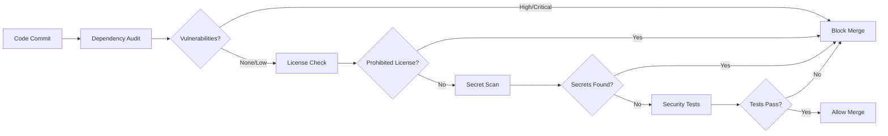

# CoinPoker Intelligence Assistant - Security Documentation

## Table of Contents

- [Overview](#overview)
- [Security Architecture](#security-architecture)
- [Automated Security Pipeline](#automated-security-pipeline)
- [Security Testing Framework](#security-testing-framework)
- [Monitoring and Alerting](#monitoring-and-alerting)
- [Anti-Detection Measures](#anti-detection-measures)
- [Process Isolation](#process-isolation)
- [Security Configurations](#security-configurations)
- [Incident Response](#incident-response)
- [Security Metrics and KPIs](#security-metrics-and-kpis)
- [Vulnerability Management](#vulnerability-management)
- [Compliance and Auditing](#compliance-and-auditing)
- [Security Best Practices](#security-best-practices)
- [Responsible Usage Guidelines](#responsible-usage-guidelines)
- [Legal Disclaimer](#legal-disclaimer)

## Overview

The CoinPoker Intelligence Assistant implements a comprehensive, multi-layered security framework designed to protect users, ensure responsible usage, and maintain system integrity. Our security-first approach includes automated vulnerability scanning, continuous monitoring, proactive threat detection, and sophisticated anti-detection measures.

### Security Philosophy

- **Defense in Depth**: Multiple layers of security controls
- **Continuous Monitoring**: Real-time security assessment and alerting
- **Automated Protection**: CI/CD pipeline with comprehensive security checks
- **Proactive Response**: Automated incident detection and response
- **Responsible Disclosure**: Transparent security practices and reporting

### Key Security Features

- **🔒 88+ Security Tests**: Comprehensive test suite covering all security aspects
- **⚡ Automated CI/CD Security**: Every commit triggers security scans
- **📊 Real-time Monitoring**: Prometheus-based security metrics and alerting
- **🛡️ Anti-Detection Framework**: Sophisticated detection avoidance strategies
- **🚨 Incident Response**: Automated security incident detection and response
- **📋 Compliance Tracking**: Automated license and vulnerability compliance

> **Important**: This application is designed for educational and analytical purposes only. Users are responsible for ensuring compliance with applicable laws, regulations, and terms of service agreements.

## Security Architecture

### Multi-Layer Security Model

```
┌─────────────────────────────────────────────────────────────┐
│                    APPLICATION LAYER                        │
│  ┌─────────────────┐  ┌─────────────────┐  ┌──────────────┐ │
│  │  Anti-Detection │  │   Risk Manager  │  │ Audit System │ │
│  │     Engine      │  │                 │  │              │ │
│  └─────────────────┘  └─────────────────┘  └──────────────┘ │
├─────────────────────────────────────────────────────────────┤
│                     PROCESS LAYER                           │
│  ┌─────────────────┐  ┌─────────────────┐  ┌──────────────┐ │
│  │ Main Process    │  │ Renderer Process│  │ Utility Proc │ │
│  │ (Security Core) │  │   (Sandboxed)   │  │ (Isolated)   │ │
│  └─────────────────┘  └─────────────────┘  └──────────────┘ │
├─────────────────────────────────────────────────────────────┤
│                    MONITORING LAYER                         │
│  ┌─────────────────┐  ┌─────────────────┐  ┌──────────────┐ │
│  │   Prometheus    │  │   Alertmanager  │  │   Grafana    │ │
│  │   (Metrics)     │  │   (Alerting)    │  │ (Dashboard)  │ │
│  └─────────────────┘  └─────────────────┘  └──────────────┘ │
├─────────────────────────────────────────────────────────────┤
│                      CI/CD LAYER                            │
│  ┌─────────────────┐  ┌─────────────────┐  ┌──────────────┐ │
│  │ Dependency Scan │  │  Secret Scanner │  │ License Check│ │
│  │   CodeQL Scan   │  │  Security Tests │  │ Vuln Scan    │ │
│  └─────────────────┘  └─────────────────┘  └──────────────┘ │
└─────────────────────────────────────────────────────────────┘
```

### Security Components

| Component | Purpose | Technology |
|-----------|---------|------------|
| **SecurityManager** | Central security orchestration | TypeScript/Node.js |
| **AntiDetection** | Detection avoidance strategies | Custom algorithms |
| **ProcessIsolation** | Secure process separation | Electron sandboxing |
| **VulnerabilityScanner** | Automated dependency scanning | NPM Audit, CodeQL |
| **SecurityMonitor** | Real-time security monitoring | Prometheus metrics |
| **IncidentResponse** | Automated incident handling | Custom workflows |

## Automated Security Pipeline

### CI/CD Security Workflow

Our GitHub Actions workflow runs comprehensive security checks on every commit:

#### Security Jobs Overview

| Job | Frequency | Purpose | Blocking |
|-----|-----------|---------|----------|
| **dependency-audit** | Every commit | NPM vulnerability scanning | ✅ Yes |
| **license-check** | Every commit | License compliance | ✅ Yes |
| **secret-scan** | Every commit | Credential detection | ✅ Yes |
| **security-tests** | Every commit | Security regression testing | ✅ Yes |
| **codeql-analysis** | Every commit | Static code analysis | ❌ No |
| **dependency-review** | Pull requests | Dependency change review | ✅ Yes |

#### Security Gates



#### Vulnerability Thresholds

| Severity | Action | Notification |
|----------|--------|--------------|
| **Critical** | ❌ Block immediately | Security team + Management |
| **High** | ❌ Block if >0 | Security team |
| **Moderate** | ⚠️  Warn if >5 | Development team |
| **Low** | ✅ Allow | Log only |

## Security Testing Framework

### Test Coverage Summary

Our comprehensive security test suite includes **88+ tests** across multiple categories:

#### Test Categories

| Category | Test Count | Coverage |
|----------|------------|----------|
| **Vulnerability Regression** | 24 tests | Core security functions |
| **Integration Security** | 18 tests | Module interactions |
| **Anti-Detection** | 16 tests | Detection avoidance |
| **Process Isolation** | 12 tests | Sandboxing & isolation |
| **Performance Security** | 10 tests | Security overhead |
| **Input Validation** | 8 tests | Malicious input handling |

#### Security Test Execution

```bash
# Run all security tests
npm run test:security

# Run specific security test categories
npm run test -- --testNamePattern="Security"
npm run test -- tests/security/VulnerabilityRegression.test.ts
npm run test -- tests/integration/SecurityIntegration.test.ts

# Run with coverage analysis
npm run test:security -- --coverage
```

#### Test Performance Metrics

| Metric | Target | Warning | Critical |
|--------|--------|---------|----------|
| **Test Execution Time** | <30s | 30-60s | >60s |
| **Test Success Rate** | >95% | 90-95% | <90% |
| **Security Coverage** | >90% | 80-90% | <80% |
| **Performance Impact** | <20ms | 20-40ms | >40ms |

## Monitoring and Alerting

### Prometheus Metrics Collection

Real-time security monitoring through comprehensive metrics:

#### Core Security Metrics

```prometheus
# Vulnerability Metrics
npm_vulnerabilities{severity="critical"} 0
npm_vulnerabilities{severity="high"} 0
npm_vulnerabilities{severity="moderate"} 2

# Security Test Metrics
security_tests_total 88
security_tests_passed 88
security_tests_failed 0

# Performance Metrics
security_overhead_ms 15.2
detection_avoidance_latency_ms 8.5

# System Resource Metrics
cpu_usage_percent 45.2
memory_usage_mb 312.8
```

#### Monitoring Infrastructure

```yaml
# monitoring/docker-compose.yml
services:
  prometheus:
    image: prom/prometheus:latest
    ports:
      - "9090:9090"
    volumes:
      - ./prometheus.yml:/etc/prometheus/prometheus.yml
      
  metrics_file_server:
    image: node:18-alpine
    command: npx http-server /metrics -p 8080
    ports:
      - "8080:8080"
    volumes:
      - ./metrics:/metrics
```

#### Alert Rules

```yaml
# monitoring/prometheus_rules.yml
groups:
  - name: security_alerts
    rules:
      - alert: CriticalVulnerability
        expr: npm_vulnerabilities{severity="critical"} > 0
        for: 0m
        labels:
          severity: critical
        annotations:
          summary: "Critical vulnerability detected"
          
      - alert: HighSecurityTestFailures
        expr: security_tests_failed > 3
        for: 5m
        labels:
          severity: high
        annotations:
          summary: "Multiple security test failures"
```

### Automated Metric Collection

Security metrics are automatically collected every 5 minutes:

```bash
# Automated collection scripts (monitoring/scripts/)
collect-npm-audit-metrics.js       # Dependency vulnerabilities
collect-github-actions-metrics.js  # CI/CD security status
collect-jest-test-metrics.js       # Security test results
collect-pre-commit-metrics.js      # Pre-commit hook performance
```

## Anti-Detection Measures

The application employs several anti-detection strategies to minimize the risk of detection by poker platforms.

### Randomized Timing

To prevent pattern detection through timing analysis, the application implements:

- **Variable Capture Intervals**: Screenshot capture timing varies randomly within configurable bounds
- **Processing Delays**: Randomized delays between processing steps
- **Action Timing Variation**: Recommendation display timing varies to avoid predictable patterns

```typescript
// Example implementation of randomized timing
function getRandomizedDelay(minMs: number, maxMs: number): number {
  return Math.floor(Math.random() * (maxMs - minMs + 1)) + minMs;
}

async function captureWithRandomizedTiming() {
  // Get randomized delay within configured bounds
  const delay = getRandomizedDelay(
    config.minProcessingDelayMs,
    config.maxProcessingDelayMs
  );
  
  // Wait for random delay
  await new Promise(resolve => setTimeout(resolve, delay));
  
  // Perform capture
  return screenCaptureModule.capture();
}
```

### Resource Usage Management

The application carefully manages system resource usage to avoid detection through resource monitoring:

- **CPU Usage Throttling**: Limits CPU usage to avoid spikes
- **Memory Footprint Control**: Manages memory allocation and garbage collection
- **GPU Usage Minimization**: Reduces GPU utilization for rendering
- **Background Priority**: Runs at lower process priority when possible

```typescript
// Example resource monitoring implementation
class ResourceMonitor {
  private cpuUsageLimit: number;
  private memoryUsageLimit: number;
  
  constructor(cpuLimit: number, memoryLimit: number) {
    this.cpuUsageLimit = cpuLimit;
    this.memoryUsageLimit = memoryLimit;
  }
  
  async monitorResources(): Promise<ResourceUsage> {
    const cpuUsage = await this.measureCpuUsage();
    const memoryUsage = await this.measureMemoryUsage();
    
    // Check if usage exceeds limits
    if (cpuUsage > this.cpuUsageLimit || memoryUsage > this.memoryUsageLimit) {
      this.throttleResources();
    }
    
    return { cpu: cpuUsage, memory: memoryUsage, timestamp: Date.now() };
  }
  
  private throttleResources(): void {
    // Implement throttling logic
    // - Reduce capture frequency
    // - Delay processing
    // - Reduce UI update frequency
  }
  
  // Implementation details for measuring resource usage
  private async measureCpuUsage(): Promise<number> { /* ... */ }
  private async measureMemoryUsage(): Promise<number> { /* ... */ }
}
```

### Visual Footprint Minimization

The application minimizes its visual footprint to reduce detectability:

- **Configurable Overlay Opacity**: Adjustable transparency for the overlay UI
- **Minimal UI Elements**: Only essential information is displayed
- **Non-Intrusive Positioning**: Overlay positioned away from game elements
- **Keyboard Shortcuts**: Quick hide/show functionality

```typescript
// Example overlay configuration
interface OverlayConfig {
  opacity: number;           // 0.0 to 1.0
  position: OverlayPosition; // top-left, top-right, bottom-left, bottom-right
  width: number;             // Width in pixels
  height: number;            // Height in pixels
  alwaysOnTop: boolean;      // Whether overlay should stay on top
  hideOnFocusLoss: boolean;  // Hide when application loses focus
  hideHotkey: string;        // Keyboard shortcut to hide overlay
}
```

### Network Traffic Obfuscation

To prevent detection through network traffic analysis:

- **Encrypted API Communication**: All LLM API requests are encrypted
- **Traffic Normalization**: Request patterns are normalized to avoid fingerprinting
- **Batched Requests**: Multiple operations are batched to reduce request frequency
- **Request Timing Randomization**: Varies the timing of network requests

```typescript
// Example network request obfuscation
class SecureApiClient {
  private apiKey: string;
  private endpoint: string;
  private requestQueue: ApiRequest[] = [];
  private batchSize: number;
  
  constructor(apiKey: string, endpoint: string, batchSize: number = 3) {
    this.apiKey = apiKey;
    this.endpoint = endpoint;
    this.batchSize = batchSize;
  }
  
  async queueRequest(request: ApiRequest): Promise<void> {
    this.requestQueue.push(request);
    
    // Process queue if it reaches batch size
    if (this.requestQueue.length >= this.batchSize) {
      await this.processBatch();
    }
  }
  
  private async processBatch(): Promise<void> {
    const batch = this.requestQueue.splice(0, this.batchSize);
    
    // Add random delay before sending
    await this.randomDelay();
    
    // Process batch
    for (const request of batch) {
      await this.sendSecureRequest(request);
      
      // Add random delay between requests
      await this.randomDelay();
    }
  }
  
  private async randomDelay(): Promise<void> {
    const delay = getRandomizedDelay(100, 500);
    await new Promise(resolve => setTimeout(resolve, delay));
  }
  
  private async sendSecureRequest(request: ApiRequest): Promise<ApiResponse> {
    // Implement secure request logic with encryption
    // ...
  }
}
```

## Process Isolation

The application uses process isolation techniques to enhance security and reduce detectability.

### Electron Process Architecture

The application leverages Electron's multi-process architecture:

- **Main Process**: Handles core application logic, system access, and security-sensitive operations
- **Renderer Process**: Manages UI rendering and user interaction
- **Utility Processes**: Handles specific tasks like screen capture and OCR processing

```
┌─────────────────────────┐
│     Main Process        │
│  (Node.js Environment)  │
│                         │
│ - Core application logic│
│ - System API access     │
│ - Security management   │
└───────────┬─────────────┘
            │
            ▼
┌─────────────────────────┐     ┌─────────────────────────┐
│   Renderer Process      │     │   Utility Processes     │
│ (Chromium Environment)  │     │                         │
│                         │◄────►- Screen capture         │
│ - UI rendering          │     │- OCR processing         │
│ - User interaction      │     │- LLM API communication  │
└─────────────────────────┘     └─────────────────────────┘
```

### Privilege Separation

The application implements privilege separation to minimize security risks:

- **Principle of Least Privilege**: Each process has only the permissions it needs
- **Sandboxed Renderer**: UI components run in a restricted sandbox
- **Controlled IPC**: Inter-process communication is strictly controlled and validated
- **API Access Restriction**: Only the main process can access sensitive APIs

```typescript
// Example IPC security implementation
// In main process
ipcMain.handle('capture-screen', async (event) => {
  // Verify sender is authorized
  if (!isAuthorizedSender(event.sender)) {
    throw new Error('Unauthorized IPC request');
  }
  
  // Perform privileged operation
  return await screenCaptureModule.capture();
});

// Helper function to verify sender
function isAuthorizedSender(sender: WebContents): boolean {
  // Implement authorization logic
  // - Check origin
  // - Verify process ID
  // - Check permissions
  return true; // Simplified for example
}
```

### Memory Management

The application implements secure memory management practices:

- **Sensitive Data Clearing**: Clears sensitive data from memory when no longer needed
- **Memory Isolation**: Keeps sensitive operations in isolated memory spaces
- **Garbage Collection Control**: Manages garbage collection to avoid memory analysis
- **Buffer Security**: Prevents buffer overflows and memory leaks

```typescript
// Example secure memory handling
class SecureMemoryHandler {
  private sensitiveData: Uint8Array | null = null;
  
  // Store sensitive data
  setData(data: Uint8Array): void {
    // Allocate new buffer
    this.sensitiveData = new Uint8Array(data.length);
    // Copy data
    this.sensitiveData.set(data);
  }
  
  // Use data securely
  useData<T>(callback: (data: Uint8Array) => T): T {
    if (!this.sensitiveData) {
      throw new Error('No data available');
    }
    
    // Use data
    const result = callback(this.sensitiveData);
    
    // Return result
    return result;
  }
  
  // Clear sensitive data
  clearData(): void {
    if (this.sensitiveData) {
      // Overwrite with zeros
      this.sensitiveData.fill(0);
      // Release reference
      this.sensitiveData = null;
      
      // Force garbage collection if possible
      if (global.gc) {
        global.gc();
      }
    }
  }
}
```
## Security Configurations

### Security Profiles

The application supports configurable security levels based on threat assessment:

```typescript
interface SecurityProfile {
  name: string;
  riskLevel: RiskLevel;
  enabledStrategies: DetectionAvoidanceStrategy[];
  resourceLimits: ResourceLimits;
}

const profiles: SecurityProfile[] = [
  {
    name: 'development',
    riskLevel: RiskLevel.Low,
    enabledStrategies: ['RandomizedDelays'],
    resourceLimits: { cpu: 30, memory: 500 }
  },
  {
    name: 'production',
    riskLevel: RiskLevel.High, 
    enabledStrategies: ['RandomizedDelays', 'CPUThrottling', 'ProcessIsolation'],
    resourceLimits: { cpu: 15, memory: 300 }
  }
];
```

### Environment Configuration

```bash
# Security settings
SECURITY_PROFILE=medium
ANTI_DETECTION_ENABLED=true
PERFORMANCE_MONITORING=true
SECURITY_MONITORING=true
RISK_ASSESSMENT_ENABLED=true
```

## Incident Response

### Automated Detection

The system automatically detects and responds to security incidents:

- **Critical Vulnerabilities**: Immediate application shutdown
- **Test Failures**: Automated rollback procedures
- **Anomaly Detection**: Real-time behavior monitoring
- **Performance Degradation**: Automatic security adjustment

### Response Workflow

1. **Detection**: Automated monitoring identifies incident
2. **Classification**: Severity assessment and categorization
3. **Containment**: Immediate containment measures
4. **Investigation**: Root cause analysis
5. **Remediation**: Fix implementation and validation
6. **Recovery**: System restoration and monitoring

## Security Metrics and KPIs

### Key Performance Indicators

| Metric | Target | Warning | Critical |
|--------|--------|---------|----------|
| **Vulnerability Resolution Time** | <24h | 24-48h | >48h |
| **Security Test Success Rate** | >95% | 90-95% | <90% |
| **Security Coverage** | >90% | 80-90% | <80% |
| **Incident Response Time** | <1h | 1-4h | >4h |

### Automated Metrics Collection

```bash
# Security metrics are collected automatically
npm_vulnerabilities{severity="critical"} 0
security_tests_passed 88
security_overhead_ms 15.2
incident_response_time_seconds 1800
```

## Vulnerability Management

### Lifecycle Management

1. **Detection**: Automated scanning identifies vulnerabilities
2. **Assessment**: Severity analysis and impact evaluation
3. **Prioritization**: Risk-based prioritization
4. **Remediation**: Fix development and testing
5. **Validation**: Security test verification
6. **Deployment**: Secure deployment of fixes

### Response Times

| Severity | Response Time | Fix Time |
|----------|---------------|----------|
| **Critical** | Immediate | 4 hours |
| **High** | 1 hour | 24 hours |
| **Medium** | 4 hours | 1 week |
| **Low** | 24 hours | 1 month |

## Compliance and Auditing

### Security Standards

- **OWASP Top 10**: Web application security risks
- **SANS Top 25**: Software security weaknesses
- **ISO 27001**: Information security management
- **NIST Framework**: Risk management

### Audit Schedule

| Audit Type | Frequency | Scope |
|------------|-----------|-------|
| **Automated Scans** | Daily | Dependencies, secrets |
| **Code Review** | Weekly | Code changes |
| **Penetration Testing** | Monthly | Full system |
| **Compliance Assessment** | Quarterly | Policies, procedures |

## Security Best Practices

### Development Guidelines

- **Input Validation**: Validate all inputs at entry points
- **Output Encoding**: Encode outputs to prevent injection
- **Authentication**: Use strong authentication mechanisms
- **Authorization**: Implement principle of least privilege
- **Cryptography**: Use established cryptographic libraries
- **Error Handling**: Secure error handling without information disclosure

### Operational Security

- **Environment Isolation**: Separate development, testing, and production
- **Secret Management**: Use environment variables for sensitive data
- **Access Control**: Role-based access control
- **Monitoring**: Comprehensive logging and monitoring
- **Backup**: Regular security-focused backups

## Responsible Usage Guidelines

### Legal Considerations

Users should be aware of the following legal considerations:

- **Jurisdiction-Specific Laws**: Online poker assistance tools may be regulated differently across jurisdictions
- **Terms of Service**: Most poker platforms prohibit automated assistance tools
- **Personal Liability**: Users are personally responsible for compliance with applicable laws and terms

### Ethical Guidelines

The application is designed for responsible use:

- **Educational Purpose**: Use the tool to learn and improve poker skills
- **Fair Play**: Avoid using the tool in ways that create unfair advantages
- **Transparency**: Be transparent about tool usage when required
- **Respect for Others**: Consider the impact on other players and the poker community

### Terms of Service Compliance

Most online poker platforms prohibit the use of real-time assistance tools. Users should:

- **Review Platform Terms**: Understand the specific terms of service for their poker platform
- **Accept Risk**: Acknowledge the risk of account suspension or termination
- **Practice Responsibly**: Consider using the tool for offline analysis or practice only

## Risk Assessment

### Detection Risk Factors

The application's detection risk is influenced by several factors:

| Risk Factor | Description | Mitigation |
|-------------|-------------|------------|
| **Screen Capture Frequency** | Higher frequency increases detection risk | Configurable, randomized intervals |
| **Resource Usage** | Abnormal CPU/memory usage can trigger detection | Resource monitoring and throttling |
| **Visual Elements** | Visible overlays can be detected by screen monitoring | Configurable opacity, position, and hotkeys |
| **Network Traffic** | Unusual API request patterns may be detected | Traffic normalization and encryption |
| **Process Behavior** | Abnormal process behavior may trigger detection | Process isolation and behavior normalization |

### Mitigation Strategies

The application implements several risk mitigation strategies:

- **Configurable Security Profiles**: Users can select different security levels
- **Adaptive Behavior**: The application adjusts behavior based on risk assessment
- **Automatic Updates**: Security measures are regularly updated
- **Fallback Mechanisms**: The application can operate in reduced functionality mode when detection risk is high

```typescript
// Example security profile configuration
enum SecurityLevel {
  LOW = 'low',
  MEDIUM = 'medium',
  HIGH = 'high',
  PARANOID = 'paranoid'
}

interface SecurityProfile {
  level: SecurityLevel;
  captureInterval: {
    min: number;  // Minimum ms between captures
    max: number;  // Maximum ms between captures
  };
  resourceLimits: {
    cpu: number;  // Maximum CPU usage percentage
    memory: number;  // Maximum memory usage in MB
  };
  networkSecurity: {
    requestBatching: boolean;
    trafficNormalization: boolean;
    encryptionLevel: 'standard' | 'high';
  };
  visualSecurity: {
    defaultOpacity: number;
    hideOnFocusLoss: boolean;
    hideOnScreenshot: boolean;
  };
}

// Predefined security profiles
const securityProfiles: Record<SecurityLevel, SecurityProfile> = {
  [SecurityLevel.LOW]: {
    level: SecurityLevel.LOW,
    captureInterval: { min: 300, max: 700 },
    resourceLimits: { cpu: 30, memory: 500 },
    networkSecurity: {
      requestBatching: false,
      trafficNormalization: false,
      encryptionLevel: 'standard'
    },
    visualSecurity: {
      defaultOpacity: 0.9,
      hideOnFocusLoss: false,
      hideOnScreenshot: false
    }
  },
  // Medium, High, and Paranoid profiles would be defined similarly
  // with increasingly strict security settings
};
```

### Risk Monitoring

The application continuously monitors detection risk:

- **Real-time Risk Assessment**: Evaluates detection risk based on multiple factors
- **Anomaly Detection**: Identifies unusual patterns that may increase risk
- **User Alerts**: Notifies users when risk level changes
- **Automatic Adjustments**: Adjusts security measures based on risk level

```typescript
// Example risk monitoring implementation
class RiskMonitor {
  private currentRiskLevel: 'low' | 'medium' | 'high' = 'low';
  private securityManager: SecurityManager;
  
  constructor(securityManager: SecurityManager) {
    this.securityManager = securityManager;
  }
  
  async assessRisk(): Promise<RiskAssessment> {
    // Gather risk factors
    const resourceUsage = await this.securityManager.getResourceUsage();
    const captureFrequency = this.securityManager.getCaptureFrequency();
    const networkActivity = await this.securityManager.getNetworkActivity();
    
    // Calculate risk scores
    const resourceRisk = this.calculateResourceRisk(resourceUsage);
    const captureRisk = this.calculateCaptureRisk(captureFrequency);
    const networkRisk = this.calculateNetworkRisk(networkActivity);
    
    // Calculate overall risk
    const overallRisk = this.calculateOverallRisk(
      resourceRisk,
      captureRisk,
      networkRisk
    );
    
    // Update current risk level if changed
    if (overallRisk.level !== this.currentRiskLevel) {
      this.currentRiskLevel = overallRisk.level;
      this.handleRiskLevelChange(overallRisk);
    }
    
    return overallRisk;
  }
  
  private handleRiskLevelChange(risk: RiskAssessment): void {
    // Notify user
    this.notifyUser(risk);
    
    // Adjust security measures
    this.securityManager.adjustSecurityMeasures(risk);
  }
  
  // Implementation details for risk calculations and notifications
  // ...
}
```

## Legal Disclaimer

**IMPORTANT LEGAL NOTICE**

The CoinPoker Intelligence Assistant (the "Software") is provided for educational and informational purposes only. By using the Software, you acknowledge and agree to the following:

1. **Terms of Service Compliance**: The use of the Software may violate the terms of service of poker platforms. Users are solely responsible for reviewing and complying with the terms of service of any platform they use.

2. **Legal Compliance**: Users are responsible for ensuring their use of the Software complies with all applicable local, state, national, and international laws and regulations.

3. **No Warranty**: The Software is provided "as is" without warranty of any kind, express or implied, including but not limited to the warranties of merchantability, fitness for a particular purpose, and noninfringement.

4. **Limitation of Liability**: In no event shall the authors, copyright holders, or contributors be liable for any claim, damages, or other liability, whether in an action of contract, tort, or otherwise, arising from, out of, or in connection with the Software or the use or other dealings in the Software.

5. **Assumption of Risk**: Users assume all risks associated with the use of the Software, including the risk of account suspension or termination by poker platforms.

6. **Educational Purpose**: The Software is intended to be used for educational purposes to improve poker skills and understanding, not to gain unfair advantages in real-money games.

By using the Software, you acknowledge that you have read, understood, and agree to be bound by this disclaimer.